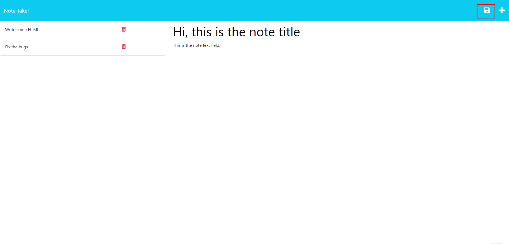
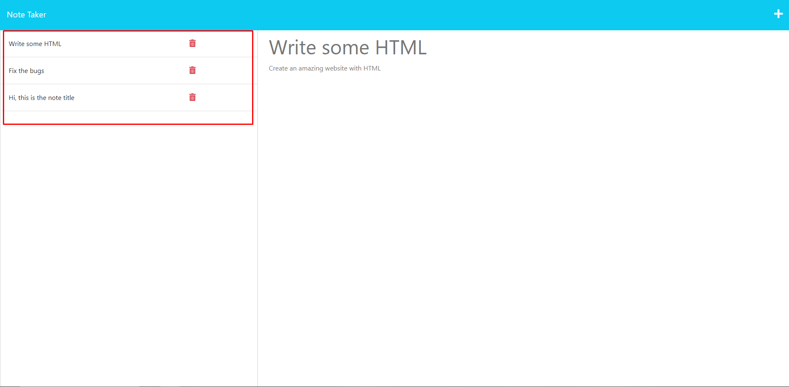
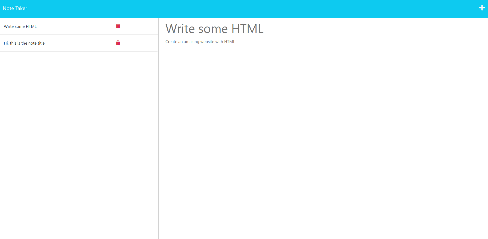

# Note-Take-ExpressJS

Note taker that uses Express and APIs to stores the data in a JSON database so that the data is persistent.

## Table of content

- [Website](#website)
- [User Story & Acceptance Criteria](#user-story)
- [What I have learnt](#what-i-have-learnt)
- [Installation](#installation)
- [Usage](#usage)

## Website

[Link to Website](https://make-that-note-c0a85980bbdb.herokuapp.com/)

## User Story

```
AS A small business owner
I WANT to be able to write and save notes
SO THAT I can organize my thoughts and keep track of tasks I need to complete
```

## Acceptance Criteria

```
GIVEN a note-taking application
WHEN I open the Note Taker
THEN I am presented with a landing page with a link to a notes page
WHEN I click on the link to the notes page
THEN I am presented with a page with existing notes listed in the left-hand column, plus empty fields to enter a new note title and the note’s text in the right-hand column
WHEN I enter a new note title and the note’s text
THEN a Save icon appears in the navigation at the top of the page
WHEN I click on the Save icon
THEN the new note I have entered is saved and appears in the left-hand column with the other existing notes
WHEN I click on an existing note in the list in the left-hand column
THEN that note appears in the right-hand column
WHEN I click on the Write icon in the navigation at the top of the page
THEN I am presented with empty fields to enter a new note title and the note’s text in the right-hand column
```

## What I have learnt

It was a very interesting week, we went through learning ExpressJS which allows us to make API's so that we could store data into a database.
It was difficult week to get your head around the idea of how ExpressJS worked at the start, but as soon as your learn the general idea with making API's, then it becomes easy to make multiple requests. I believed the hardest part of this week was how to layout your code to make it more readable and getting all the modules that you have exported to work together. On the otherhand, once you had structured out all the files, it become easy to read and understand what the code was doing and also where to find the error that were occuring as most of the scripts were around maximum 100 lines.

## Installation

Clone the project and then in the terminal run:

```bash
npm i;
```

Also available [here](https://make-that-note-c0a85980bbdb.herokuapp.com/)

## Usage

### Cloned Project

If you have cloned the project all you have to do is the run the command below:

```bash
npm run start
```

### Landing Page

You will be presented with a landing page


### Making and saving a note

You are able to make a note by typing in the right column, once you press save the API will be called and the data will be saved to the database
to persist.



### Viewing the saved notes

On the left hand column, you will see all the notes that you have saved and when you click them the database will be called to fetch the note.



### Deleting notes

Once you are finished with a note and don't want to have it anymore, you can click the trash icon to delete the note.
In the image below, you can see that Fix bugs has gone.


